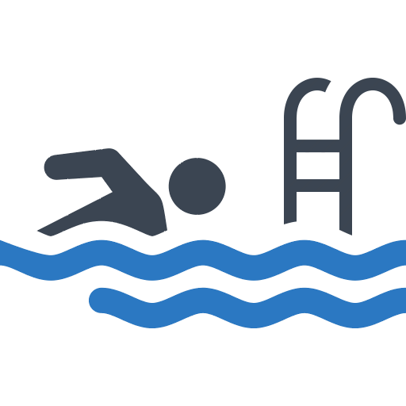
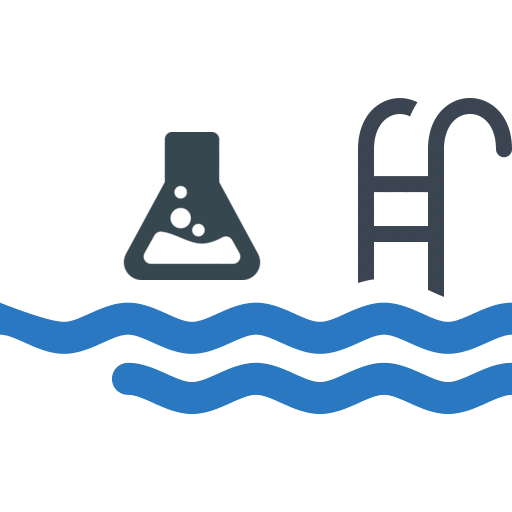
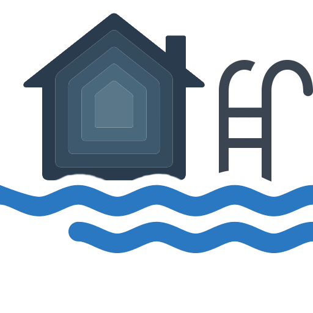
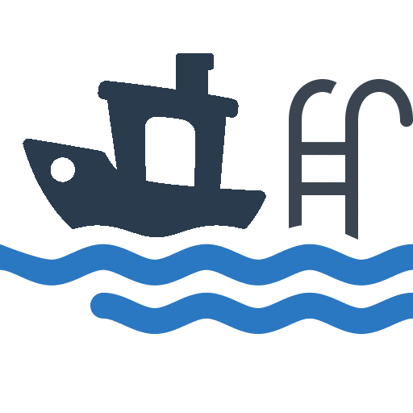
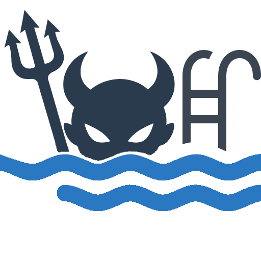

  

#

Open-source software and hardware for pool automation, water chemistry, and related systems.

AquaDaemon is the umbrella for projects that connect, control, monitor, and extend pool equipment.

[Website](https://aquadaemon.org)

## Projects

<table>
<tr>
<td width="50%" valign="top">

### [AqualinkD](https://github.com/aqualinkd/AqualinkD)

Jandy RS pool automation.

AqualinkD connects Jandy RS pool equipment to modern home automation systems, providing control, monitoring, MQTT integration, APIs, and a web interface.

[Website](https://aqualinkd.com) · [GitHub](https://github.com/aqualinkd/AqualinkD)

 

</td>
<td width="50%" valign="top">

### [AquaChemD](https://github.com/aqualinkd/AquachemD)

Automated pool water chemistry.

AquaChemD provides monitoring and dosing control for pool water chemistry, with support for sensors, dosing equipment, safety interlocks, and integrations.

[Website](https://aquadaemon.org/aquachemd/) · [GitHub](https://github.com/aqualinkd/AquachemD)

 

</td>
</tr>

<tr>
<td width="50%" valign="top">

### [homebridge-aquadaemon](https://github.com/AquaDaemon/homebridge-aquadaemon)

AquaDaemon integration for Apple Home.

Integrate AqualinkD or AquaChemD devices and services with Apple Home through Homebridge.

[GitHub](https://github.com/AquaDaemon/homebridge-aquadaemon)

 

</td>
<td width="50%" valign="top">

### [AqualinkD serial HAT](https://github.com/aqualinkd/aqualinkd-zero-hat)

Official AqualinkD RS485 adapter.

Provide power and RS485 data to your Raspberry Pi directly from your pool control panel. No more separate power supplies and USB-to-RS485 adapters.

[GitHub](https://github.com/aqualinkd/aqualinkd-zero-hat)

 

</td>
</tr>

<tr>
<td width="50%" valign="top">

### [3D Printable](https://github.com/AquaDaemon/3D-Printable)

3D-printable hardware for AquaDaemon projects.

Cases, covers, brackets, and other printable parts for AqualinkD, AquaChemD, and shared hardware.

[GitHub](https://github.com/AquaDaemon/3D-Printable)

 

</td>
<td width="50%" valign="top">

### [AqualinkD kits & hats](http://aqualinkd.com/purchase/)

Don't want to build yourself.

Pre made 'plug-in & go' kits and HATs are available to purchase

[Website](http://aqualinkd.com/purchase/)

 

</td>

</tr>

</table>

## About

AquaDaemon projects are open source and developed around real-world pool automation and control hardware.

[Website](https://aquadaemon.org) · [GitHub](https://github.com/AquaDaemon)

<!--
# AquaDaemon

Open-source software and hardware for pool automation, water chemistry, and related systems.

AquaDaemon is the umbrella for projects that connect, control, monitor, and extend pool equipment.
[Website](https://aquadaemon.org)

## Main Projects

### [AqualinkD](https://github.com/aqualinkd/AqualinkD)

Jandy RS pool automation.

AqualinkD connects Jandy RS pool equipment to modern home automation systems, providing control, monitoring, MQTT integration, APIs, and a web interface.

[Website](https://aqualinkd.com) · [GitHub](https://github.com/aqualinkd/AqualinkD)

##
### [AquaChemD](https://github.com/aqualinkd/AquachemD)

Automated pool water chemistry.

AquaChemD provides monitoring and dosing control for pool water chemistry, with support for sensors, dosing equipment, safety interlocks, and integrations.

[Website](https://aquadaemon.org/aquachemd/) · [GitHub](https://github.com/aqualinkd/AquachemD)

##
### [homebridge-aquadaemon](https://github.com/AquaDaemon/homebridge-aquadaemon)

AquaDaemon integration for Apple Home.

Integrate AqualinkD or AquachemD devices and services with Apple Home through Homebridge.

##
### [AqualinkD serial HAT](https://github.com/aqualinkd/aqualinkd-zero-hat)

Official AqualinkD RS485 adapter.

Provide power and RS485 data to your Raspberry Pi directly from your pool control panel. (no more separate power supplies and USB2RS485 adapters)

##
### [3D Printable](https://github.com/AquaDaemon/3D-Printable)

3D-printable hardware for AquaDaemon projects.

Cases, covers, brackets, and other printable parts for AqualinkD, AquaChemD, and shared hardware.

## About

AquaDaemon projects are open source and developed around real-world pool automation and control hardware.

[Website](https://aquadaemon.org) · [GitHub](https://github.com/AquaDaemon)

-->
